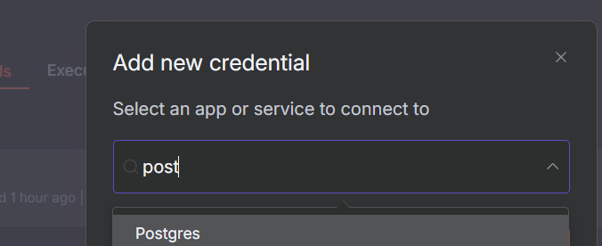
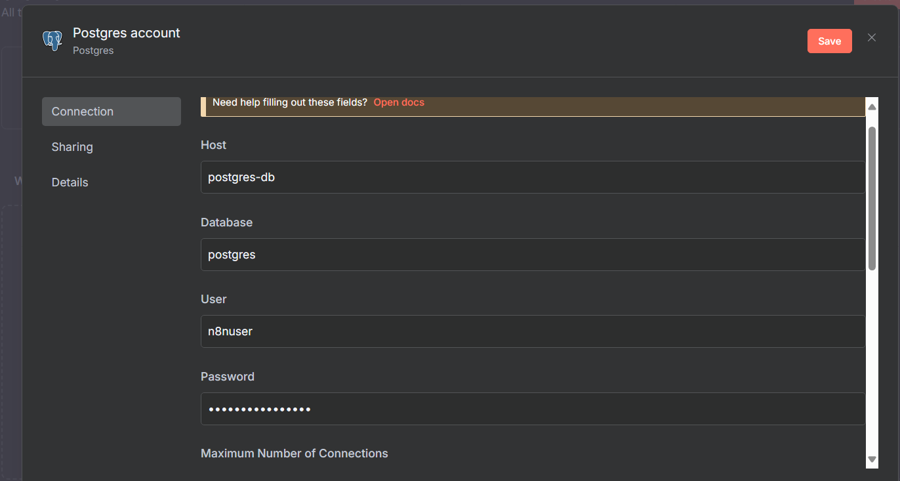
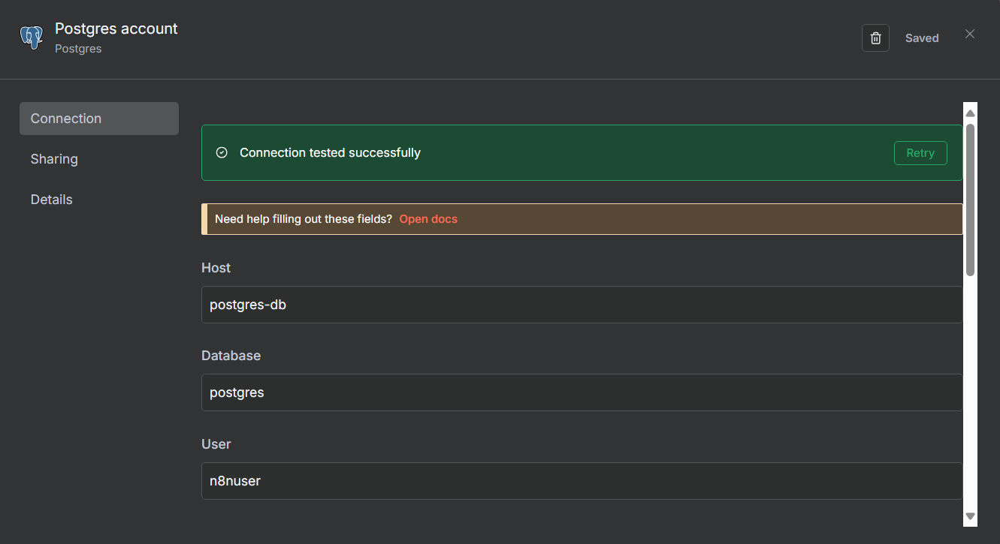
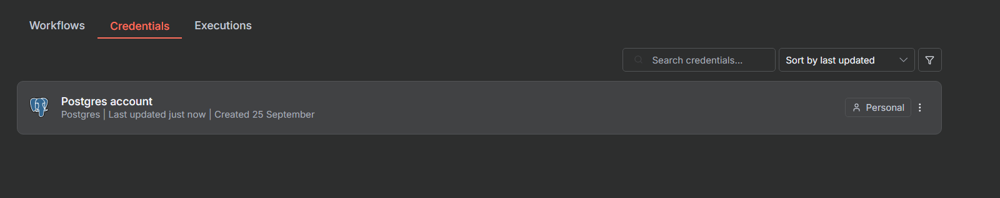

## INTEGRANTES.
| Nombre | Cargo | URL GitHub |
|---|:---:|---:|
| Daniel Alquinga | :technologist: Desarrollador |  |
| Daniel Baldeon | :technologist: Desarrollador |  |
| Bryan Miño | :technologist: Desarrollador |  |
| Wilson Segovia | :technologist: Desarrollador |  |
| Leonardo Tuguminago | :technologist: Desarrollador |  |

# 1. Despliegue de entorno de automatización con n8n integrados con PostgreSQL en Docker Compose

El objetivo de este trabajo es desplegar una aplicacion con n8n esta esta integrada con su propia base de datos PostgreSQL, utilizando Docker Compose. Se busca aplicar  conceptos de orquestación de contenedores, persistencia de datos, separación de servicios y buenas prácticas en la gestión de entornos

# 2. Configuración e Instalación

### PASO 1: 📂 Estructura de Archivos


### PASO 2: Creacion de la red de docker

```bash
docker network create n8n-network
```


### PASO 3: Despliegue de contenedor de n8n

Nos ubicamos en la carpeta n8n y ejecutar el siguiente comando

```bash
docker compose -f docker-compose-n8 up -d
```

**Salida Esperada**


### PASO 4: Despliege de Contenedor Postgres

Ya que nos encontramos en la carpeta n8n  es necesario ejecutar la siguiente linea de comando.

```bash
docker compose -f ../postgres/compose.postgres.yml  up -d
```

**Salida Esperada**


### PASO 5: Revisamos contenedores levantados

```bash
    docker ps
```

**Salida Esperada**


### PASO 6: Ingreso al portar del Servidor N8N 

```bash
    http://localhost:5678/
```

**Salida Esperada**

### PASO 8: Informacion adicional del Servidor N8N


### PASO 9: Seccion de Gestor de Base de datos en N8N



### PASO 10: Configuracion de Credenciales 

    Parametros obtenidos del archivos .env del repositorio

```bash
    Host: postgres-db
    Database: postgres
    User: n8nuser
    Password: Super_Segura123!
```




### PASO 11: Verificar Ingresos Satisfactorio

Se verifica  que la conexion sea Exitosa 




### PASO 12:  Verifcacion de N8N con Postgres

    Se verifica que la conexion de la base de datos este vinculada con el contenedor N8N.



FIN.

# 3. Conclusiones

- La implementación de Docker Scout dentro de GitHub Actions permite automatizar completamente el análisis de vulnerabilidades en imágenes Docker, integrando la seguridad directamente en el pipeline de CI/CD.

- Al ejecutar el análisis en cada push al repositorio, se identifica proactivamente vulnerabilidades en etapas tempranas del desarrollo, reduciendo riesgos de seguridad en producción.

- Docker Scout proporciona visibilidad completa sobre las vulnerabilidades en todas las capas de la imagen, facilitando la identificación de dependencias problemáticas en la aplicación FastAPI.

- GitHub Actions proporciona registros detallados de cada ejecución, creando un historial auditable de los estados de seguridad de la aplicación a lo largo del tiempo.
